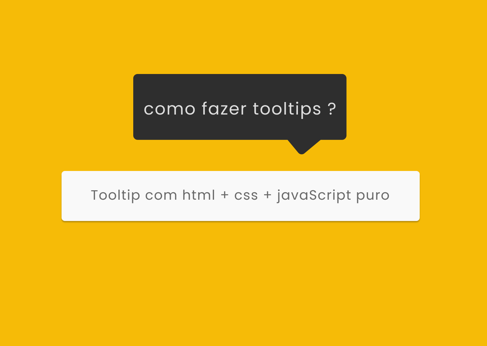
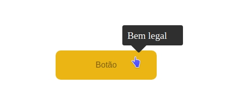

# Tooltip

Depois de tanto tempo planejando fazer isso, hoje eu tirei um tempo para fazer o meu próprio tooltip, sim eu sei que tem plugins já desenvolvido tudo bonito, só para usar no site, porém, e se tu quiser mudar o estilo dele ? Muitas vezes não dá, só o que poderá mudar é a cor, e o texto dele. Pensando nisso eu desenvolvi o meu próprio estilo de tooltip, assim podendo customizar como eu bem querer. O estilo do tooltip é de que ele se mova com o mouse, ficando mais dinâmico, e que ao tirar o mouse de cima do componente ele irá desaparecer.

## **O resultado final ficou assim:**

O artigo explicando como foi feito, e explicando cada etapa, pode ser acessado no meu [linkedin](https://www.linkedin.com/pulse/tooltips-marlon-symczecym).

---

---

## Agradecimentos

Agradeço a quem viu, e espero que gostem do resultado, e também da breve explicação em meu linkedin.

**Autor:** Marlon Symczecym
